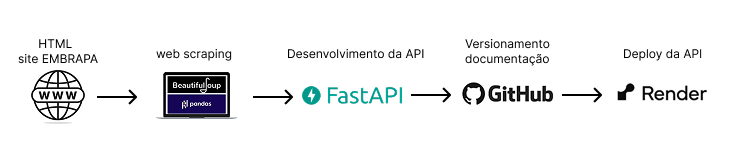

# API-VITNI_EMBRAPA

API desenvolvida com **FastAPI** para atender ao projeto VITNI da EMBRAPA. Esta API serve como backend para fornecer dados e processamentos específicos relacionados à área de pesquisa do projeto.

## 🚀 Tecnologias Utilizadas

- [FastAPI](https://fastapi.tiangolo.com/)
- Uvicorn (servidor ASGI)
- Python 3.x
- [BeutifulSoup, Pandas]

## Fluxograma da Arquitetura da API



## 📁 Estrutura do Projeto

API-VITNI_EMBRAPA/
├── app/
│ ├── main.py # Ponto de entrada da aplicação
│ ├── routers/ # Arquivos de rotas/endpoints
│ ├── services/ # Lógica de negócio
│ └── models/ # Definições de schemas/pydantic
├── requirements.txt
└── README.md


## 🧭 Fluxo de Funcionamento

[Cliente] --> [Requisição HTTP] --> [FastAPI Router]
|
v
[Função Endpoint / Rota Específica]
|
v
[Processamento]
|
v
[Resposta JSON (status + dados)]
|
v
[Cliente]

## 🧪 Documentação Interativa

Swagger UI: http://127.0.0.1:8000/docs

## 🤝 Contribuições
Contribuições são bem-vindas! Sinta-se à vontade para abrir issues ou pull requests com melhorias, sugestões ou correções.

## ⚙️ Instalação 

1. Clone o repositório:

```bash
git clone https://github.com/udanielsantin/API-VITNI_EMBRAPA.git
cd API-VITNI_EMBRAPA
```

2. Crie e ative o ambiente virtual:

```bash
python -m venv venv
source venv/bin/activate  # No Windows: venv\Scripts\activate
```

3. Instale as dependências:

```bash
pip install -r requirements.txt
```

## ▶️ Execução
Inicie o servidor com Uvicorn:

```bash
uvicorn app.main:app --reload
```

